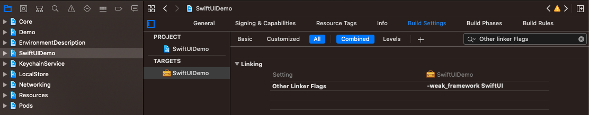


## SwiftUIDemo
Aqui é mostrado que é possível adicionar uma feature ao projeto utilizando SwiftUI e os devidos cuidados com as condicionais.

> É importante ressaltar, que encontramos o seguinte [erro] ao tentar rodar o app em dispositivos com iOS inferior ao 13.0. A solução foi a mesma da resposta citada no link anterior, segue imagem: 

[erro]: https://stackoverflow.com/questions/57907817/dyld-library-not-loaded-swiftui-when-app-runs-on-ios-12-using-availableios-13
